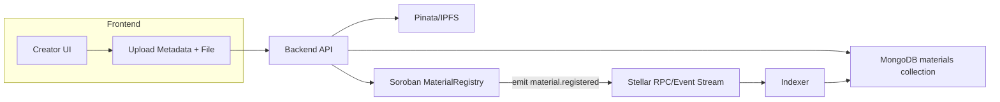
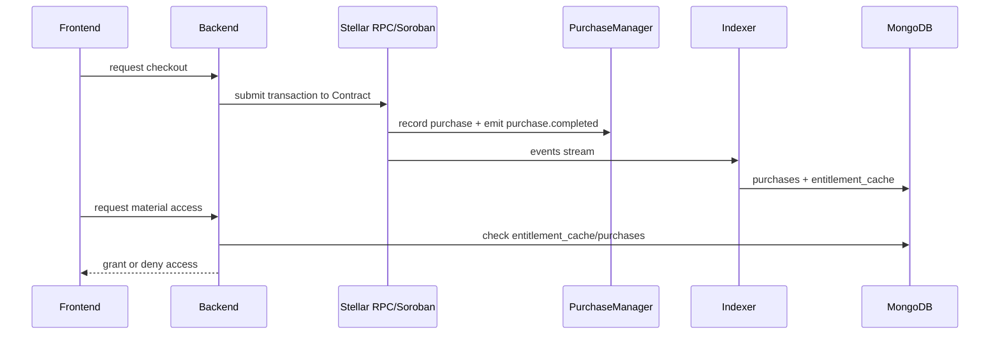
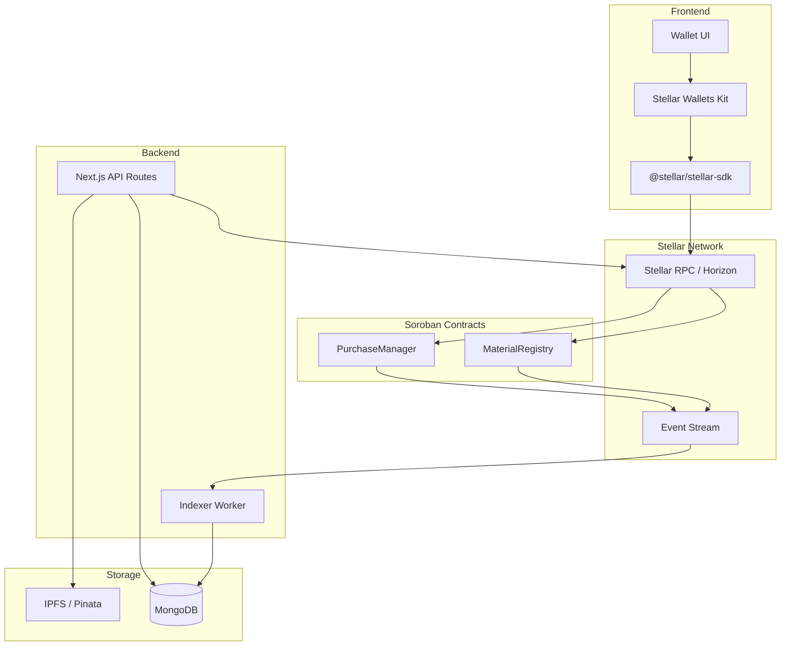

# EduVault Architecture

This document shows the high-level data and payment flow for EduVault.

## Publishing Flow (Creator)

## Checkout & Entitlement Flow (Buyer)

## Indexer Responsibilities

- Polls Stellar RPC for events related to Soroban contracts
- Writes sync events into `sync_events` to ensure idempotency
- Applies event side-effects (materials, purchases, entitlement_cache)
- On transient failures: records retry metadata in `dead_letter_events`
- Provides a `reprocess-deadletter.mjs` script for maintainers to reprocess

## Source-of-truth boundaries

- On-chain (Soroban contracts): authoritative for entitlement and payments
- MongoDB: authoritative for application catalog, caches, and derived state
- IPFS/Pinata: authoritative for file bytes and pinned metadata content

Link: see `scripts/run-stellar-indexer.mjs` and `scripts/reprocess-deadletter.mjs` for operational commands.
# EduVault Architecture

## 1. System Goals

EduVault needs to do four things reliably:

- ingest and catalog educational materials
- process low-cost purchases
- verify who is entitled to access a resource
- pay creators in a way that works across borders

## 2. Current Application Architecture

### Frontend

- Next.js App Router application
- React-based dashboard, marketplace, and onboarding flows
- Tailwind CSS styling
- Wallet connection UI for current prototype flows

### Backend

- Next.js route handlers under `src/app/api`
- JWT cookie-based session handling for profile and dashboard actions
- MongoDB for users and materials
- Nodemailer-based welcome email flow

### Storage

- document files and thumbnails uploaded through Pinata
- metadata JSON pinned to IPFS
- searchable application state stored in MongoDB

### Prototype chain layer

- EVM wallet connection via wagmi and RainbowKit
- archived ERC-721 proof of concept in `archive/legacy-evm/contracts/EduVault.sol`

## 3. Target Stellar-Native Architecture

The canonical Soroban contract boundary and event model are documented in [`docs/soroban-contract-architecture.md`](soroban-contract-architecture.md). The end-to-end purchase and entitlement sequence is documented in [`docs/stellar-purchase-flow.md`](stellar-purchase-flow.md).

### Stellar Network Component Diagram

### On-chain contracts

- `MaterialRegistry`
  - stores immutable references to content metadata (`material_id`, `metadata_hash`, `rights_hash`)
  - binds creator address, accepted-asset quotes, and payout share configuration
  - emits `material.registered`, `material.sale_terms_updated`, and `material.status_updated` events
  - source of truth for seller-authored listing state
- `PurchaseManager`
  - holds global platform config (treasury, fee, allowed assets, pause flag)
  - validates material purchasability and asset eligibility
  - collects buyer payment, routes creator and platform payouts atomically
  - writes per-buyer entitlement records keyed by `(material_id, buyer)`
  - emits `purchase.completed` and `payout.distributed` events
  - source of truth for payment settlement and buyer entitlements
- optional asset issuance layer
  - creator or institution-issued Stellar assets for access credits, scholarships, or cohort passes

### Off-chain components

- `web-app`
  - creator onboarding via Stellar wallet connection (`@creit-tech/stellar-wallets-kit`)
  - material upload wizard with IPFS pinning
  - checkout UI that constructs and signs Soroban transactions
  - entitlement-aware download gating
- `api`
  - material ingestion and metadata validation
  - entitlement verification (cache-first with on-chain fallback)
  - entitlement-aware file delivery
  - email and notification workflows
- `indexer`
  - polls Stellar RPC for normalized Soroban events
  - writes idempotent `sync_events` entries
  - maintains `purchases` and `entitlement_cache` derived collections in MongoDB
  - dead-letter queue with retry support

### Wallet integration

EduVault uses the Stellar Wallets Kit (`@creit-tech/stellar-wallets-kit`) which supports multiple wallets through a unified API: Freighter (browser extension), LOBSTR (mobile), Albedo (web-based), Rabet (browser extension), and Stellar Bifrost (web-based).

The `WalletProvider` at `src/providers/WalletProvider.jsx` manages connection state, balance loading, session persistence, and transaction signing. See [`docs/stellar-wallet-setup.md`](stellar-wallet-setup.md) for user-facing setup instructions.

## 4. Data Model

### Off-chain collections

- `users`
  - profile data
  - contact information
  - wallet mapping
- `materials`
  - title
  - description
  - thumbnail URL
  - IPFS metadata URL
  - creator wallet
  - search and visibility metadata
- `purchases`
  - derived cache of settled purchase events
- `entitlement_cache`
  - denormalized mirror of on-chain entitlement state for fast UI reads

### On-chain state

- material identifier
- creator account
- accepted-asset quotes
- payout shares
- rights hash
- buyer entitlement records
- platform fee and treasury parameters

## 5. Purchase Flow

The full purchase sequence diagram is documented in [`docs/stellar-purchase-flow.md`](stellar-purchase-flow.md). The summary below describes the eight phases:

1. Creator uploads content via the Upload Wizard.
2. Backend pins files and metadata to IPFS, stores catalog metadata in MongoDB.
3. Creator registers the material on Soroban via `MaterialRegistry.register_material()`, setting price quotes and payout shares.
4. Buyer initiates checkout; backend returns current quotes from the on-chain `MaterialRecord`.
5. Wallet signs a Stellar transaction targeting `PurchaseManager.purchase()`.
6. `PurchaseManager` validates the material, transfers funds atomically across creator and treasury recipients, and writes an `EntitlementRecord`.
7. Indexer detects the `purchase.completed` event, creates `purchases` and `entitlement_cache` records in MongoDB.
8. API verifies entitlement before issuing the download response.

### On-chain data model (Soroban)

The Soroban contracts use the following key structures:

| Contract | Storage Key | Purpose |
| --- | --- | --- |
| `MaterialRegistry` | `material(material_id)` | Full `MaterialRecord` including creator, hashes, quotes, payout shares |
| `MaterialRegistry` | `creator_nonce(address)` | Monotonic nonce for generating unique `material_id` values |
| `PurchaseManager` | `entitlement((material_id, buyer))` | `EntitlementRecord` — active flag, purchase ID, asset, amount |
| `PurchaseManager` | `platform_config` | Treasury address, fee in basis points, pause flag |
| `PurchaseManager` | `allowed_asset(address)` | Global asset allowlist |

## 6. Event Flow

Soroban contracts emit events that the indexer consumes to build derived MongoDB state:

| Event | Emitter | Indexed Into | Purpose |
| --- | --- | --- | --- |
| `material.registered` | MaterialRegistry | `materials` | Seed canonical chain linkage for a material |
| `material.sale_terms_updated` | MaterialRegistry | `materials` | Refresh marketplace price and asset caches |
| `material.status_updated` | MaterialRegistry | `materials` | Hide archived or paused materials from purchase flows |
| `purchase.completed` | PurchaseManager | `purchases`, `entitlement_cache` | Record settled purchase and grant download access |
| `payout.distributed` | PurchaseManager | Creator earnings view | Payout audit trail and treasury reconciliation |

Events are normalized by the indexer into stable shapes and logged idempotently in `sync_events`. Failed event processing is captured in `dead_letter_events` for manual retry.

## 7. Security Considerations

- Keep file bytes off-chain to avoid leaking paid content.
- Use entitlement checks before download access. Cache-first reads with on-chain fallback.
- Treat MongoDB as a query cache and application store, not the source of truth for purchase rights.
- Keep payout logic on-chain where it is auditable.
- Every state-changing path uses Soroban auth checks for the relevant actor.
- Asset transfer failures revert the entire purchase. No silent fallback to an alternate asset.
- Separate issuer and distribution responsibilities if asset issuance is introduced.
- Never store private keys in the web application.
- v1 does not support refunds or entitlement revocation.

## 8. Deployment Direction

### Current

- Vercel or similar platform for the Next.js application
- managed MongoDB
- Pinata for IPFS pinning

### Planned

- Stellar testnet deployment for `MaterialRegistry` and `PurchaseManager` contracts
- production RPC/Horizon provider
- background worker for event indexing and entitlement reconciliation
- Soroban contract upgrade pattern: admin-gated Wasm hash replacement (see [`docs/soroban-upgrade-pattern.md`](soroban-upgrade-pattern.md))

## 9. Design Principle

The chain should secure settlement and rights. The web application should optimize search, onboarding, and delivery. EduVault does not need to put files on-chain to benefit from Stellar.

## References

| Document | Purpose |
| --- | --- |
| [`soroban-contract-architecture.md`](soroban-contract-architecture.md) | Contract boundaries, invariants, storage model, event contract |
| [`stellar-purchase-flow.md`](stellar-purchase-flow.md) | Detailed checkout and entitlement sequence diagram |
| [`stellar-integration.md`](stellar-integration.md) | Developer environment setup and integration code patterns |
| [`stellar-wallet-setup.md`](stellar-wallet-setup.md) | User-facing Stellar wallet installation and connection guide |
| [`creator-publishing-guide.md`](creator-publishing-guide.md) | Step-by-step tutorial for uploading and listing materials |
| [`soroban-upgrade-pattern.md`](soroban-upgrade-pattern.md) | Contract upgrade strategy and migration rules |
| [`purchase-flow-architecture.md`](purchase-flow-architecture.md) | Hybrid on-chain/off-chain purchase boundaries |
