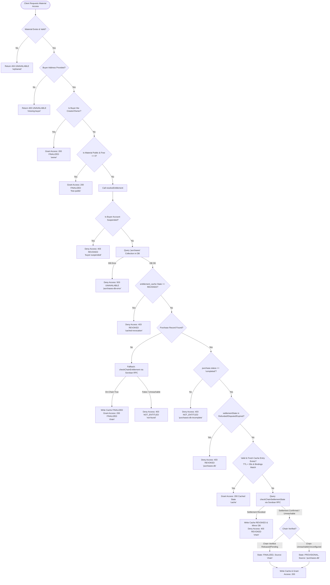

# Entitlement Authorization Decision Flow

This document describes the authorization policy implemented in [`src/lib/entitlement.js`](file:///home/abujulaybeeb/Documents/Drips/Drips%2013/eduvault-archive/src/lib/entitlement.js). It serves as the single source of truth for understanding how EduVault verifies whether a given wallet address holds a valid, active entitlement to access or download protected educational content.

---

## 1. High-Level Overview & Principles

EduVault uses a **hybrid Web3 authorization architecture**:

1. **On-Chain Authoritative State**: The Soroban `PurchaseManager` contract records settled purchases and active entitlements.
2. **Off-Chain Gated Delivery**: Next.js API routes (e.g., `/api/materials/[id]/download`, `/api/materials/access`) gate file downloads and IPFS streams.

To protect creator content while maintaining low latency and resilience against temporary network partitions or indexer lag, [`src/lib/entitlement.js`](file:///home/abujulaybeeb/Documents/Drips/Drips%2013/eduvault-archive/src/lib/entitlement.js) operates under four core security principles:

* **Fail-Closed Security**: Any unexpected database failure, network error, malformed parameter, or unhandled exception results in an `UNAVAILABLE` state (access denied with HTTP 503/400/404), never a default allow.
* **Cache Can Never Grant Unauthorized Access**: The cache only serves to bypass redundant on-chain RPC calls for previously verified *allowing* verdicts. A fresh check against the database is always performed first, and revocations immediately override any prior cached decision.
* **Sticky & Terminal Revocations**: Once a purchase is marked as `Refunded`, `Disputed`, or `Expired`, or if a buyer account is suspended, the decision transitions to `REVOKED`. Revocations are terminal and cannot be overridden by stale cache entries.
* **Context Binding**: Cached entitlement decisions are cryptographically and logically bound to `walletAddress`, `materialId`, `purchaseId`, `networkPassphrase`, `contractId`, and the material's `contentHash`. If the contract ID, network, or underlying IPFS content changes, the cached decision is invalidated automatically.

---

## 2. The Five Entitlement States

Every evaluation by `resolveEntitlement()` resolves to exactly one of the following five states:

| State | Product Meaning | Download Access | HTTP Status | Cache Behavior |
| :--- | :--- | :--- | :--- | :--- |
| `FINALIZED` | Verified, settled entitlement confirmed on-chain or backed by a completed, non-revoked purchase. | **Allowed** (`hasAccess: true`) | `200 OK` | Cached up to `ENTITLEMENT_CACHE_TTL_MS` (default: 30s). |
| `PROVISIONAL` | Local completed purchase record exists, but on-chain RPC verification was temporarily unreachable or unconfigured. | **Allowed** (`hasAccess: true`) | `200 OK` | Bounded by short TTL; re-evaluates against chain upon expiry. |
| `REVOKED` | Access explicitly rescinded due to refund, dispute, expiration, or buyer account suspension. | **Denied** (`hasAccess: false`) | `403 Forbidden` | Written to cache immediately; sticky and terminal. |
| `NOT_ENTITLED` | No purchase record exists locally, and on-chain simulation confirmed no entitlement exists (or purchase is incomplete). | **Denied** (`hasAccess: false`) | `403 Forbidden` | Not cached as allowing; denies access. |
| `UNAVAILABLE` | Transient infrastructure failure (MongoDB error, missing material, invalid parameters). | **Denied** (`hasAccess: false`) | `503 Service Unavailable` / `400` / `404` | Never cached; fails closed. |

> [!IMPORTANT]
> Only `FINALIZED` and `PROVISIONAL` grant download access. Every other state strictly denies delivery.

---

## 3. Entitlement Decision Flow Diagram

The diagram below illustrates the exact order of checks executed when a protected route invokes `authorizeMaterialAccess()` and `resolveEntitlement()`:



---

## 4. Key Guarantees & Edge Cases Handled

### 4.1 "Cache Can Never Be the Reason a Download is Served"
A critical invariant in EduVault is that the `entitlement_cache` is **not an independent authorization authority**.
* **Fresh Local DB Lookup First**: Every request queries `database.collection('purchases')` fresh before consulting the cache.
* **Immediate Revocation Recognition**: If an indexer event or admin API marks a purchase as `Refunded`, `Disputed`, or `Expired` in MongoDB, that revoking state is evaluated immediately on the next call—regardless of any non-expired cached entries.
* **Cache TTL Expiration**: Allowing states (`FINALIZED`, `PROVISIONAL`) are cached with a short TTL (`ENTITLEMENT_CACHE_TTL_MS`, 30 seconds by default). When expired, the system re-validates against on-chain settlement state.

### 4.2 Handling Indexer Lag (On-Chain Fallback)
If a buyer completes an on-chain transaction on Stellar/Soroban, but network or indexer latency has delayed the MongoDB `purchases` event ingestion:
1. `resolveEntitlement()` detects `purchase == null`.
2. It immediately executes an on-chain fallback simulation via `checkChainEntitlement(materialId, buyerAddress)`.
3. If Soroban returns `true` (`has_entitlement`), the user is immediately granted access (`FINALIZED`) and the cache is updated.
4. If Soroban is unreachable or returns `false`, access is denied (`NOT_ENTITLED`), avoiding false positives.

### 4.3 Context & Binding Matches
To prevent replay attacks or cross-environment cache pollution, `bindingMatches()` validates:
* `contractId`: Must match the active `PURCHASE_MANAGER_CONTRACT_ID`.
* `network`: Must match the configured Stellar `NETWORK_PASSPHRASE`.
* `contentHash`: Must match the material's current IPFS CID / file hash.

If any of these change, the cached verdict is bypassed and re-derived from primary sources.

---

## 5. Soroban On-Chain Verification Details & Current Status

The on-chain verification helpers in `src/lib/entitlement.js` simulate read-only Soroban contract invocations using `simulateTransaction`:

### 5.1 `buildHasEntitlementXdr(materialId, buyerAddress)`
* Constructs an invocation targeting `has_entitlement(material_id: Bytes, buyer: Address)` on the `PurchaseManager` contract.
* Formats `materialId` as a 32-byte buffer (supporting 64-character hex strings or raw 32-byte IDs).
* Decodes the return value via `decodeBoolean(xdrBase64)` using `stellar-sdk`'s `scValToNative`.

### 5.2 `buildSettlementStateXdr(purchaseId)`
* Constructs an invocation targeting `get_settlement_state(purchase_id: u64)` on the `PurchaseManager` contract.
* Decodes the enum response (`Pending`, `Released`, `Disputed`, `Refunded`, `Expired`) via `decodeSettlementState(xdrBase64)`.

> [!NOTE]
> **Current Implementation Status**:
> In the current testnet prototype phase, `simulateTransaction` is executed against `STELLAR_RPC_URL` when configured. If `STELLAR_RPC_URL` or `PURCHASE_MANAGER_CONTRACT_ID` is absent or unreachable during local development, the service gracefully degrades to `PROVISIONAL` access based on verified local database records.

---

## 6. Support & Debugging Playbook

When investigating support tickets (e.g., *"Buyer completed payment but cannot download material"*), follow this step-by-step checklist in order:

```text
Step 1: Validate Inputs & Account Status
  ├── Verify buyerAddress is a valid Stellar G-address (e.g., GABC...)
  └── Query 'users' collection: ensure status != 'suspended'

Step 2: Check Local Purchases Collection
  ├── Query 'purchases': { materialId, buyerAddress: normalizeBuyerAddress(buyerAddress) }
  ├── Check status: must be 'completed' (not 'pending' or 'failed')
  └── Check settlementState: verify it is NOT 'Refunded', 'Disputed', or 'Expired'

Step 3: Check Entitlement Cache Collection
  ├── Query 'entitlement_cache': { materialId, buyerAddress }
  ├── Check state: if 'revoked', check source to see why it was invalidated
  └── Check bindings: verify contractId, network, and contentHash match current deployment

Step 4: Check Soroban On-Chain State
  ├── Simulate PurchaseManager.has_entitlement(materialId, buyerAddress) via RPC
  └── Verify transaction hash on Stellar Expert / Horizon to ensure contract execution succeeded

Step 5: Remediation
  ├── If indexer missed the event: run 'node scripts/reprocess-deadletter.mjs' or trigger indexer sync
  └── If cache is stale: call invalidateEntitlement(materialId, buyerAddress, 'support-refresh')
```

---

## 7. Related Documents

* [`docs/architecture.md`](file:///home/abujulaybeeb/Documents/Drips/Drips%2013/eduvault-archive/docs/architecture.md) — System goals, boundaries, and high-level architecture.
* [`docs/purchased-content-and-entitlements.md`](file:///home/abujulaybeeb/Documents/Drips/Drips%2013/eduvault-archive/docs/purchased-content-and-entitlements.md) — Buyer library overview and contract access points.
* [`docs/purchase-flow-architecture.md`](file:///home/abujulaybeeb/Documents/Drips/Drips%2013/eduvault-archive/docs/purchase-flow-architecture.md) — Hybrid on-chain/off-chain transaction flow.
* [`docs/soroban-contract-architecture.md`](file:///home/abujulaybeeb/Documents/Drips/Drips%2013/eduvault-archive/docs/soroban-contract-architecture.md) — Detailed Soroban smart contract invariants and storage schema.

## Entitlement reconciliation before protected downloads (#665)

Download authorization is tied to verified on-contract purchase state, not just cached entitlement data. `PurchaseManager::reconcile_entitlement(material_id, buyer)` re-checks the cached entitlement against the purchase settlement before a protected download is allowed:

- **Settlement still `Pending` with an active entitlement** -> authorized (`Ok(true)`).
- **Missing entitlement record** -> denied (`EntitlementRevoked`) - the indexer event never landed or the record was removed.
- **Revoked entitlement or non-`Pending` settlement (refunded/released)** -> denied (`EntitlementRevoked` / `EntitlementStale`) - a stale cache can never grant access silently.

Delayed events, missing events, and revoked entitlements all resolve to safe denied states instead of cached allow decisions.
