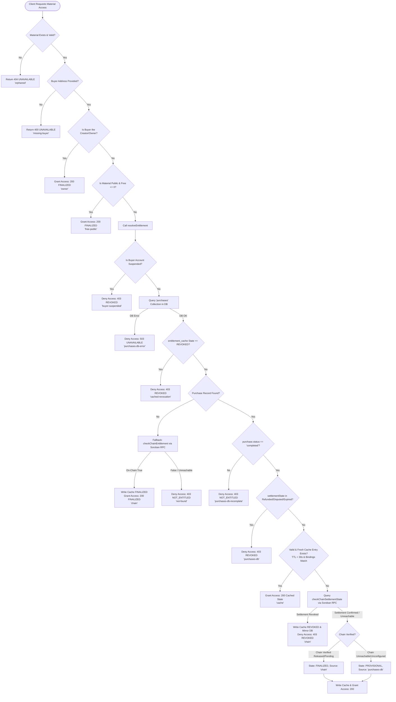

# Entitlement Authorization Decision Flow

This document describes the authorization policy implemented in [`src/lib/entitlement.js`](file:///home/abujulaybeeb/Documents/Drips/Drips%2013/eduvault-archive/src/lib/entitlement.js). It serves as the single source of truth for understanding how EduVault verifies whether a given wallet address holds a valid, active entitlement to access or download protected educational content.

---

## 1. High-Level Overview & Principles

EduVault uses a **hybrid Web3 authorization architecture**:

1. **On-Chain Authoritative State**: The Soroban `PurchaseManager` contract records settled purchases and active entitlements.
2. **Off-Chain Gated Delivery**: Next.js API routes (e.g., `/api/materials/[id]/download`, `/api/materials/access`) gate file downloads and IPFS streams.

To protect creator content while maintaining low latency and resilience against temporary network partitions or indexer lag, [`src/lib/entitlement.js`](file:///home/abujulaybeeb/Documents/Drips/Drips%2013/eduvault-archive/src/lib/entitlement.js) operates under four core security principles:

* **Fail-Closed Security**: Any unexpected database failure, network error, malformed parameter, or unhandled exception results in an `UNAVAILABLE` state (access denied with HTTP 503/400/404), never a default allow.
* **Cache Can Never Grant Unauthorized Access**: The cache only serves to bypass redundant on-chain RPC calls for previously verified *allowing* verdicts. A fresh check against the database is always performed first, and revocations immediately override any prior cached decision.
* **Sticky & Terminal Revocations**: Once a purchase is marked as `Refunded`, `Disputed`, or `Expired`, or if a buyer account is suspended, the decision transitions to `REVOKED`. Revocations are terminal and cannot be overridden by stale cache entries.
* **Context Binding**: Cached entitlement decisions are cryptographically and logically bound to `walletAddress`, `materialId`, `purchaseId`, `networkPassphrase`, `contractId`, and the material's `contentHash`. If the contract ID, network, or underlying IPFS content changes, the cached decision is invalidated automatically.

---

## 2. The Five Entitlement States

Every evaluation by `resolveEntitlement()` resolves to exactly one of the following five states:

| State | Product Meaning | Download Access | HTTP Status | Cache Behavior |
| :--- | :--- | :--- | :--- | :--- |
| `FINALIZED` | Verified, settled entitlement confirmed on-chain or backed by a completed, non-revoked purchase. | **Allowed** (`hasAccess: true`) | `200 OK` | Cached up to `ENTITLEMENT_CACHE_TTL_MS` (default: 30s). |
| `PROVISIONAL` | Local completed purchase record exists, but on-chain RPC verification was temporarily unreachable or unconfigured. | **Allowed** (`hasAccess: true`) | `200 OK` | Bounded by short TTL; re-evaluates against chain upon expiry. |
| `REVOKED` | Access explicitly rescinded due to refund, dispute, expiration, or buyer account suspension. | **Denied** (`hasAccess: false`) | `403 Forbidden` | Written to cache immediately; sticky and terminal. |
| `NOT_ENTITLED` | No purchase record exists locally, and on-chain simulation confirmed no entitlement exists (or purchase is incomplete). | **Denied** (`hasAccess: false`) | `403 Forbidden` | Not cached as allowing; denies access. |
| `UNAVAILABLE` | Transient infrastructure failure (MongoDB error, missing material, invalid parameters). | **Denied** (`hasAccess: false`) | `503 Service Unavailable` / `400` / `404` | Never cached; fails closed. |

> [!IMPORTANT]
> Only `FINALIZED` and `PROVISIONAL` grant download access. Every other state strictly denies delivery.

---

## 3. Entitlement Decision Flow Diagram

The diagram below illustrates the exact order of checks executed when a protected route invokes `authorizeMaterialAccess()` and `resolveEntitlement()`:


```mermaid
flowchart TD
    Start([Client Requests Material Access]) --> CheckMaterial{Material Exists & Valid?}
    
    CheckMaterial -- No --> Orph404[Return 404 UNAVAILABLE\n'orphaned']
    CheckMaterial -- Yes --> CheckBuyer{Buyer Address Provided?}
    
    CheckBuyer -- No --> Bad400[Return 400 UNAVAILABLE\n'missing-buyer']
    CheckBuyer -- Yes --> CheckOwner{Is Buyer the Creator/Owner?}
    
    CheckOwner -- Yes --> AllowOwner[Grant Access: 200 FINALIZED\n'owner']
    CheckOwner -- No --> CheckFree{Is Material Public & Free <= 0?}
    
    CheckFree -- Yes --> AllowFree[Grant Access: 200 FINALIZED\n'free-public']
    CheckFree -- No --> Resolve[Call resolveEntitlement]
    
    Resolve --> CheckSuspended{Is Buyer Account Suspended?}
    CheckSuspended -- Yes --> DenySuspended[Deny Access: 403 REVOKED\n'buyer-suspended']
    
    CheckSuspended -- No --> QueryPurchases[Query 'purchases' Collection in DB]
    QueryPurchases -- DB Error --> DenyDBErr[Deny Access: 503 UNAVAILABLE\n'purchases-db-error']
    
    QueryPurchases -- DB OK --> CheckStickyRevoked{entitlement_cache State == REVOKED?}
    CheckStickyRevoked -- Yes --> DenySticky[Deny Access: 403 REVOKED\n'cached-revocation']
    
    CheckStickyRevoked -- No --> HasLocalPurchase{Purchase Record Found?}
    
    %% Fallback path when no local purchase
    HasLocalPurchase -- No --> CheckChainDirect[Fallback: checkChainEntitlement via Soroban RPC]
    CheckChainDirect -- On-Chain True --> CacheAndFinalize[Write Cache FINALIZED\nGrant Access: 200 FINALIZED\n'chain']
    CheckChainDirect -- False / Unreachable --> DenyNotFound[Deny Access: 403 NOT_ENTITLED\n'not-found']
    
    %% Local purchase found
    HasLocalPurchase -- Yes --> CheckCompleted{purchase.status == 'completed'?}
    CheckCompleted -- No --> DenyIncomplete[Deny Access: 403 NOT_ENTITLED\n'purchases-db-incomplete']
    
    CheckCompleted -- Yes --> CheckLocalRevoked{settlementState in Refunded/Disputed/Expired?}
    CheckLocalRevoked -- Yes --> DenyRefundedLocal[Deny Access: 403 REVOKED\n'purchases-db']
    
    CheckLocalRevoked -- No --> CheckFreshCache{Valid & Fresh Cache Entry Exists?\nTTL < 30s & Bindings Match}
    CheckFreshCache -- Yes --> AllowCache[Grant Access: 200 Cached State\n'cache']
    
    CheckFreshCache -- No --> CheckChainSettlement[Query checkChainSettlementState via Soroban RPC]
    CheckChainSettlement -- Settlement Revoked --> WriteRevoke[Write Cache REVOKED & Mirror DB\nDeny Access: 403 REVOKED\n'chain']
    CheckChainSettlement -- Settlement Confirmed / Unreachable --> DetermineState{Chain Verified?}
    
    DetermineState -- Chain Verified Released/Pending --> SetFinalized[State: FINALIZED, Source: 'chain']
    DetermineState -- Chain Unreachable/Unconfigured --> SetProvisional[State: PROVISIONAL, Source: 'purchases-db']
    
    SetFinalized --> WriteCacheAndAllow[Write Cache & Grant Access: 200]
    SetProvisional --> WriteCacheAndAllow
```

---

## 4. Key Guarantees & Edge Cases Handled

### 4.1 "Cache Can Never Be the Reason a Download is Served"
A critical invariant in EduVault is that the `entitlement_cache` is **not an independent authorization authority**.
* **Fresh Local DB Lookup First**: Every request queries `database.collection('purchases')` fresh before consulting the cache.
* **Immediate Revocation Recognition**: If an indexer event or admin API marks a purchase as `Refunded`, `Disputed`, or `Expired` in MongoDB, that revoking state is evaluated immediately on the next call—regardless of any non-expired cached entries.
* **Cache TTL Expiration**: Allowing states (`FINALIZED`, `PROVISIONAL`) are cached with a short TTL (`ENTITLEMENT_CACHE_TTL_MS`, 30 seconds by default). When expired, the system re-validates against on-chain settlement state.

### 4.2 Handling Indexer Lag (On-Chain Fallback)
If a buyer completes an on-chain transaction on Stellar/Soroban, but network or indexer latency has delayed the MongoDB `purchases` event ingestion:
1. `resolveEntitlement()` detects `purchase == null`.
2. It immediately executes an on-chain fallback simulation via `checkChainEntitlement(materialId, buyerAddress)`.
3. If Soroban returns `true` (`has_entitlement`), the user is immediately granted access (`FINALIZED`) and the cache is updated.
4. If Soroban is unreachable or returns `false`, access is denied (`NOT_ENTITLED`), avoiding false positives.

### 4.3 Context & Binding Matches
To prevent replay attacks or cross-environment cache pollution, `bindingMatches()` validates:
* `contractId`: Must match the active `PURCHASE_MANAGER_CONTRACT_ID``.
* `network`: Must match the configured Stellar `NETWORK_PASSPHRASE`.
* `contentHash`: Must match the material's current IPFS CID or file hash.

If any of these change, the cached verdict is bypassed and re-derived from primary sources.

---

## 5. Soroban On-Chain Verification Details & Current Status

The on-chain verification helpers in `src/lib/entitlement.js` simulate read-only Soroban contract invocations using `simulateTransaction`:

### 5.1 `buildHasEntitlementXdr(materialId, buyerAddress)`
* Constructs an invocation targeting `has_entitlement(material_id: Bytes, buyer: Address)` on the `PurchaseManager` contract.
* Formats `materialId` as a 32-byte buffer (supporting 64-character hex strings or raw 32-byte IDs).
* Decodes the return value via decodeBoolean(xdrBase64)` using `stellar-sdk`'s `scValToNative`.

### 5.2 `buildSettlementStateXdr(purchaseId)`
* Constructs an invocation targeting `get_settlement_state(purchase_id: u64)` on the `PurchaseManager` contract.
* Decodes the enum response (`Pending`, `Released`, `Disputed`, `Refunded`, `Expired`) via `decodeSettlementState(xdrBase64)`.

> [!NOTE]
> **Current Implementation Status**:
> In the current testnet prototype phase, `simulateTransaction` is executed against `STELLAR_RPC_URL` when configured. If `STELLAR_RPC_URL` or `PURCHASE_MANAGER_CONTRACT_ID` is absent or unreachable during local development, the service gracefully degrades to `PROVISIONAL` access based on verified local database records.

---

## 6. Support & Debugging Playbook

When investigating support tickets (e.g., *"Buyer completed payment but cannot download material"*), follow this step-by-step checklist in order:

```text
Step 1: Validate Inputs & Account Status
  ├── Verify buyerAddress is a valid Stellar G-address (e.g., GABC...)
  └── Query 'users' collection: ensure status != 'suspended'

Step 2: Check Local Purchases Collection
  ├── Query 'purchases': { materialId, buyerAddress: normalizeBuyerAddress(buyerAddress) }
  ├── Check status: must be 'completed' (not 'pending' or 'failed')
  └── Check settlementState: verify it is NOT 'Refunded', 'Disputed', or 'Expired'

Step 3: Check Entitlement Cache Collection
  ├── Query 'entitlement_cache': { materialId, buyerAddress }
  ├── Check state: if 'revoked', check source to see why it was invalidated
  └── Check bindings: verify contractId, network, and contentHash match current deployment

Step 4: Check Soroban On-Chain State
  ├── Simulate PurchaseManager.has_entitlement(materialId, buyerAddress) via RPC
  └── Verify transaction hash on Stellar Expert / Horizon to ensure contract execution succeeded

Step 5: Remediation
  ├── If indexer missed the event: run 'node scripts/reprocess-deadletter.mjs' or trigger indexer sync
  └── If cache is stale: call invalidateEntitlement(materialId, buyerAddress, 'support-refresh')
```

---

## 6b. Backend ↔ Contract Authorization Matrix (Issue #683)

The API layer must prove that unauthorized creators and buyers **cannot**
publish, update, purchase, refund, or access resources — and must map contract
auth failures onto stable HTTP shapes instead of leaking raw contract codes.

`src/lib/api/authorizationBoundary.js` centralizes that boundary:

- `assertResourceOwner({ caller, owner, upgradeAdmin, action })` — fails closed
  (401 missing wallet, 403 not-the-owner) unless the caller is the resource
  owner or the platform upgrade admin.
- `assertBuyer({ caller, buyer, action })` — fails closed unless the caller is the
  recorded buyer for the resource.

---

## 7. Permission-Diff Preview for Role and Policy Changes

Before a role, policy, or access update is applied, EduVault computes a
**before/after permission diff** so maintainers can see exactly what will
change. The diff is produced by `src/lib/permissions/permissionDiff.js` and
is exposed through the admin preview endpoint `PROST :/api/admin/permissions/preview`.

### 7.1 Diff Model

A permission is a tuple of `(actor, scope, action)`. The diff is a canonical,
deterministic comparison of the **before** policy and the **after** policy:

| Category | Meaning |
| :--- | :--- |
| `added` | Permissions present in after but not in before. |
| `removed` | Permissions present in before but not in after. |
| `unchanged` | Permissions present in both policies. |

Each entry carries the `actor`, `scope`, `action`, and a `source` field
(`'role'` or `'policy'`) so the UI can group and explain changes.

The diff also reports **which actors are affected** (`affectedActors`) and the
**scopes and actions** that changed (`affectedScopes`, `affectedActions`).

### 7.2 Broad Change Detection & Confirmation

A change is considered **broad** when it either:

- adds or removes the wildcard actor ``*`` or wildcard scope ``*``;
- grants a permission to the `admin` actor or the `admin` scope;
- changes more than `broadChangeThreshold` permissions (default: 10);
- adds or removes a `delete` or `publish` action on any scope.

When a change is broad, the preview response sets `requiresConfirmation: true`
and includes a `reasons` array. The apply endpoint `POST /api/admin/permissions`
rejects the request with `428 Precondition Required` unless the caller passes
explicit confirmation in the request body (`confirmation: { confirmed: true,
 confirmationToken }`). The confirmation token is derived from the diff
hash, so a modified policy cannot reuse a token issued for a different diff.

### 7.3 Stale Policy Input

The preview and apply flows are optimistic-concurrency safe. Each policy has
`{revision, updatedAt}`. The client submits the `expectedRevision` it observed
when building the diff. If the stored revision no longer matches (another
maintainer applied a change in the meantime), the apply endpoint returns `409
Conflict` with `code: 'stale-policy-input'` and the client must re-run the
preview. The preview endpoint itself also rejects a stale `before` snapshot
with the same code so maintainers never see a diff computed against a policy
that has already moved.

### 7.4 Denied Actors

Denied actors are represented explicitly in the policy as `deniedActors`. An
actor listed in `deniedActors` cannot receive any permission from a role or
policy grant, even if a matching rule exists. The diff reports these actors
under `deniedActors` and any attempt to add a permission for a denied actor is
dropped from the after policy and surfaced as a `denied-actor` warning.

### 7.5 No-op Changes

When `before` and `after` produce identical permission sets, the diff returns
empty `added` and `removed` arrays, `requiresConfirmation: false`, and a
>code: 'no-op'` marker. The apply endpoint still records the attempt in the
audit log but does not mutate the policy or bump the revision.

### 7.6 Audit & Response Shape

`PROST /api/admin/permissions/preview` returns:

```json
{
  "diff": {
    "added": [{ "actor": "teacher", "scope": "materials", "action": "publish", "source": "role" }],
    "removed": [{ "actor": "student", "scope": "materials", "action": "delete", "source": "policy" }],
    "unchanged": [{ "actor": "admin", "scope": "*", "action": "*", "source": "role" }],
    "affectedActors": ["teacher", "student"],
    "affectedScopes": ["materials"],
    "affectedActions": ["publish", "delete"],
    "deniedActors": [],
    "requiresConfirmation": false,
    "reasons": [],
    "diffHash": "3b1f4c2a...",
    "expectedRevision": 42
  },
  "code": "ok"
}
```

The apply endpoint accepts the same before/after snapshots plus an optional
`confirmation` object and returns the applied diff and the new revision.

### 7.7 Test Coverage

The diff suite covers the acceptance criteria explicitly:

- **no-op**: identical policies produce empty added/removed and `code: 'no-op'`.
- **narrow change**: a single added or removed permission does not require
  confirmation.
- **broad change**: wildcard or admin grants require confirmation and are
  rejected without a valid confirmation token.
- **denied actor**: a grant for a denied actor is dropped and reported.
- **stale policy input**: a mismatched `expectedRevision` returns `409 Conflict`
  with `code: 'stale-policy-input'`.

Run the suite with:

```bash
node --test src/lib/permissions/permissionDiff.test.js
# or, if using the repo test runner:
npm test -- permissionDiff
```

---

## 8. Related Documents

- [`docs/entitlement-authorization.md`](file:///docs/entitlement-authorization.md) — this document.
- [`docs/marketplace-flows.md`](file:///docs/marketplace-flows.md) — purchase and
  refund lifecycle.
- [`docs/storage-workflows.md`](file:///docs/storage-workflows.md) — IPFS and
  student-owned record storage.
