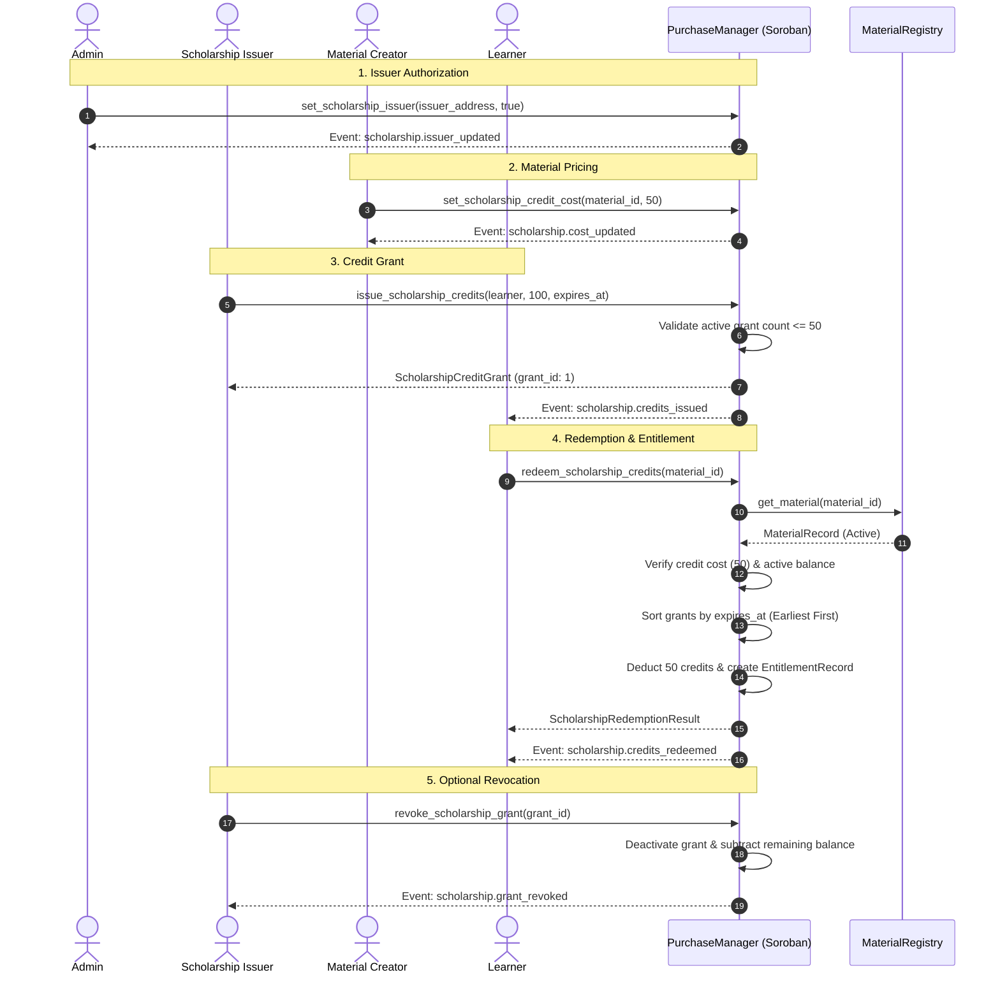

# Soroban Scholarship Credit Subsystem

**Status:** On-Chain Implemented (`soroban/contracts/purchase-manager/src/lib.rs`)  
**Off-Chain Integration Status:** On-Chain Only (Indexer event parsing for `scholarship.*` events pending)  
**Contract Scope:** `PurchaseManager` contract

---

## 1. Overview

The Scholarship Credit Subsystem provides a transparent, on-chain grant and redemption mechanism for educational content on EduVault. Authorized scholarship issuers (e.g. educational institutions, foundations, or platform sponsors) can grant non-transferable scholarship credits directly to learner wallets. Learners redeem these credits to acquire entitlements for scholarship-eligible learning materials without requiring native token payments.

---

## 2. Actor Model

```
 ┌─────────────┐       grant_issuer       ┌──────────────────────┐
 │    Admin    │ ───────────────────────> │  ScholarshipIssuer   │
 └─────────────┘                          └──────────────────────┘
        │                                            │
        │                                            │ issue_credits
        ▼                                            ▼
 ┌─────────────┐                          ┌──────────────────────┐
 │   Creator   │                          │       Learner        │
 └─────────────┘                          └──────────────────────┘
        │                                            │
        │ set_credit_cost                            │ redeem_credits
        ▼                                            ▼
 ┌───────────────────────────────────────────────────────────────┐
 │               PurchaseManager Soroban Contract                │
 └───────────────────────────────────────────────────────────────┘
```

1. **Admin (`PlatformConfig` Admin)**:
   - Authorizes or revokes scholarship issuer addresses via `set_scholarship_issuer(issuer, enabled)`.
   - Maintains administrative oversight and emergency grant revocation capabilities.
2. **Scholarship Issuer (`ScholarshipIssuer`)**:
   - Grants credit packages (`ScholarshipCreditGrant`) to specific learner addresses via `issue_scholarship_credits(learner, amount, expires_at)`.
   - Can revoke unused credits from issued grants via `revoke_scholarship_grant(grant_id)`.
3. **Material Creator / Admin**:
   - Configures the scholarship credit redemption price for specific materials via `set_scholarship_credit_cost(material_id, credit_cost)`.
   - Materials without a configured credit cost are ineligible for scholarship redemption (`ContentNotScholarshipEligible`).
4. **Learner**:
   - Holds active scholarship grants up to `MAX_ACTIVE_SCHOLARSHIP_GRANTS` (50 active grants).
   - Redeems spendable credits via `redeem_scholarship_credits(material_id)` to receive a valid content entitlement.

---

## 3. Grant Lifecycle & Storage Model

Each credit issuance creates an on-chain `ScholarshipCreditGrant` record:

```rust
pub struct ScholarshipCreditGrant {
    pub grant_id: u64,
    pub learner: Address,
    pub issuer: Address,
    pub total_credits: i128,
    pub remaining_credits: i128,
    pub issued_at: u32,
    pub expires_at: Option<u32>,
    pub active: bool,
}
```

### Lifecycle States

1. **Issuance**:
   - Created with `active: true` and `remaining_credits == total_credits`.
   - Added to the learner's active grant index (`ScholarshipGrantsForLearner`).
   - The learner's aggregate spendable balance (`ScholarshipBalance`) increases by `amount`.
2. **Active**:
   - The grant can be drawn down by redemptions as long as `expires_at` (if set) is greater than the current ledger timestamp and `active == true`.
3. **Consumed**:
   - When `remaining_credits` reaches 0 through redemptions, the grant remains in historical storage but no longer contributes to the learner's spendable balance.
4. **Expired**:
   - Once the network ledger timestamp exceeds `expires_at`, any remaining credits on the grant become unspendable.
5. **Revoked**:
   - An issuer or admin calls `revoke_scholarship_grant(grant_id)`. `active` is set to `false`, remaining credits are zeroed, and the learner's aggregate balance is reduced accordingly.

---

## 4. Redemption Flow & Earliest-Expiry-First Guarantee

When a learner calls `redeem_scholarship_credits(material_id)`:

1. **Eligibility Check**:
   - Verifies the material exists, is active in the registry, and has a configured credit cost (`get_scholarship_credit_cost(material_id)`).
   - Verifies the learner does not already possess an active entitlement for `material_id`.
   - Verifies duplicate redemptions are prevented via `ScholarshipRedemption((learner, material_id))` lookup.
2. **Earliest-Expiry-First Deterministic Drawdown**:
   - To protect issuers and learners from letting expiring credits go to waste, active grants belonging to the learner are sorted in ascending order of `expires_at` (with non-expiring grants `expires_at == None` sorted last).
   - Credits are deducted sequentially from the earliest-expiring grants until the full material credit cost is satisfied.
3. **Entitlement & Settlement**:
   - Upon successful credit deduction, a persistent `EntitlementRecord` is created for the learner.
   - A `SettlementRecord` is initialized in `Pending` state (note: scholarship redemptions do not involve escrow funds).
   - A `ScholarshipCreditsRedeemedEvent` is emitted.

---

## 5. Scalability & Resource Constraints

- **`MAX_ACTIVE_SCHOLARSHIP_GRANTS` = 50**:
  - A single learner address can hold at most 50 active grants simultaneously.
  - *Rationale*: Soroban execution budgets limit CPU cycles and memory footprint per transaction. Sorting and iterating over grant balances during `redeem_scholarship_credits` is strictly bounded by 50 to guarantee deterministic, bounded transaction execution within ledger limits.
  - Attempting to issue a 51st active grant to a learner fails with `PurchaseError::TooManyActiveGrants` (100).

---

## 6. Contract Error Reference

Every scholarship operation performs strict validation. Below is the reference table of all scholarship-specific contract errors:

| Error Name | Error Code | Description / Trigger Condition |
|---|---|---|
| `InvalidCreditAmount` | 90 | Attempted to issue or adjust credits with an amount `<= 0`. |
| `InvalidCreditCost` | 91 | Attempted to set a material credit cost `<= 0`. |
| `InsufficientScholarshipCredits` | 92 | Learner's aggregate active, non-expired credit balance is lower than the material cost. |
| `ScholarshipGrantNotFound` | 93 | Requested `grant_id` does not exist in contract storage. |
| `ScholarshipGrantExpired` | 94 | Attempted to redeem against a grant whose `expires_at` timestamp has passed. |
| `ScholarshipGrantInactive` | 95 | Attempted to operate on a grant that was revoked or fully consumed (`active == false`). |
| `GrantAlreadyProcessed` | 96 | Attempted to process a grant that has already reached terminal revocation/consumption. |
| `ContentNotScholarshipEligible` | 97 | Material does not have a configured scholarship credit cost (`get_scholarship_credit_cost` returns `None`). |
| `RedemptionAlreadyExists` | 98 | Learner has already redeemed credits for this material ID. |
| `InvalidExpiry` | 99 | Expiry ledger timestamp provided during grant issuance is less than or equal to current ledger timestamp. |
| `TooManyActiveGrants` | 100 | Learner active grant count would exceed `MAX_ACTIVE_SCHOLARSHIP_GRANTS` (50). |

---

## 7. Off-Chain Integration Status

> [!IMPORTANT]
> **Indexer Integration Gap Notice**  
> As of the current release, the off-chain Stellar indexer (`src/lib/indexer/stellarIndexer.js`) does not yet parse or index Soroban `scholarship.*` topics (`scholarship.credits_issued`, `scholarship.credits_redeemed`, `scholarship.grant_revoked`, `scholarship.cost_updated`, `scholarship.issuer_updated`).  
> 
> Scholarship credit balances and redemptions operate entirely on-chain through contract RPC calls (`get_scholarship_credit_balance`, `get_scholarship_grant`, `get_scholarship_redemption`). Off-chain database tables (`scholarship_grants`, `scholarship_redemptions`) will be populated once event indexer handlers for scholarship topics are implemented in a future update.

---

## 8. End-to-End Sequence Diagram


