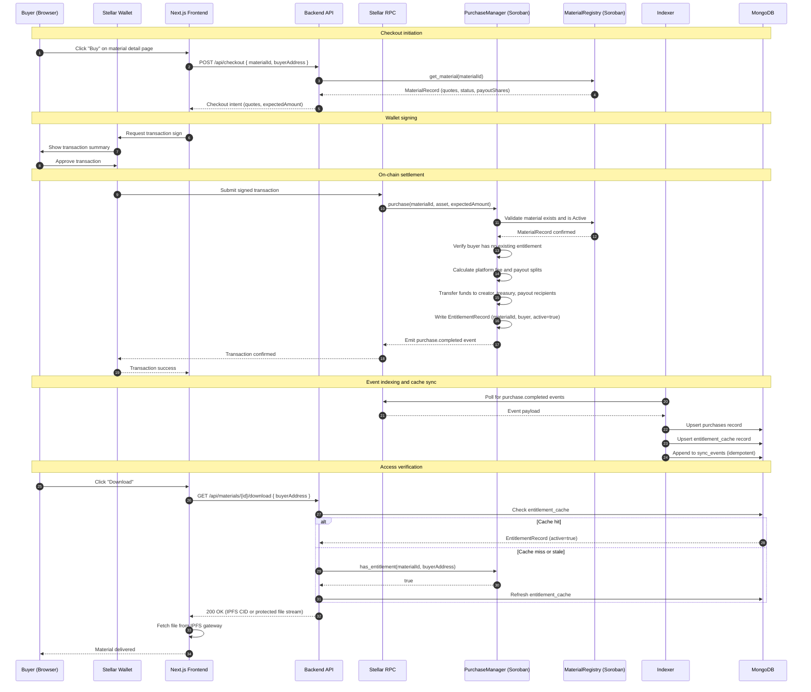

# Stellar/Soroban Purchase & Entitlement Flow

This document provides a detailed sequence diagram for the checkout and entitlement flow in EduVault's Stellar-native architecture.

## Overview

The purchase flow bridges a browser-based wallet interaction with on-chain Soroban settlement and off-chain entitlement verification. A buyer initiates checkout, signs a Stellar transaction that the `PurchaseManager` contract settles atomically, and the backend indexes the resulting event to grant or deny download access.

## Sequence Diagram

## Flow Phases

### 1. Checkout Initiation

The frontend sends the buyer's wallet address and the material ID to the backend. The backend reads the current `MaterialRecord` from the `MaterialRegistry` contract to confirm the material is `Active`, retrieve the accepted-asset quotes, and return the expected payment amount to the frontend.

### 2. Wallet Signing

The frontend constructs a Stellar transaction targeting the `PurchaseManager` contract and forwards it to the buyer's Stellar wallet (e.g., Freighter). The wallet displays a human-readable summary of the transaction, including the asset, amount, and destination, before the buyer approves.

### 3. On-Chain Settlement

`PurchaseManager.purchase()` performs the following atomically in a single Soroban transaction:

1. Validates the material exists and is `Active` via `MaterialRegistry`.
2. Confirms the selected asset is in the material's accepted-asset quotes and is globally allowed.
3. Verifies the buyer does not already hold an active entitlement for this material.
4. Transfers the gross payment from the buyer to creator payout recipients and the platform treasury.
5. Writes an `EntitlementRecord` keyed by `(materialId, buyer)`.
6. Emits a `purchase.completed` event.

If any step fails, the entire transaction reverts. No partial state is written.

### 4. Event Indexing

The backend indexer polls Stellar RPC for `purchase.completed` events, then:

- Creates or updates a `purchases` record in MongoDB.
- Upserts an `entitlement_cache` entry for fast download-gate reads.
- Logs a normalized `sync_events` entry for idempotency tracking.

### 5. Download Access Gating

When a buyer requests a material download, the backend checks `entitlement_cache` for a valid entitlement. On a cache miss, it falls back to a direct `has_entitlement()` simulation call to the `PurchaseManager` contract. Only confirmed entitlement holders receive the IPFS CID or protected file stream.

## Failure States

| State | HTTP Status | Description |
| --- | --- | --- |
| No wallet connected | 401 | Buyer address is missing from the request |
| Material not active | 400 | Material is paused or archived |
| Stale price | 400 | Transaction amount does not match current contract quote |
| Duplicate purchase | 200 | Entitlement already exists; returns existing entitlement |
| Contract simulation error | 500 | Soroban RPC or contract call failure |
| Download without entitlement | 403 | No active entitlement found on-chain or in cache |

## Related Documentation

- [Architecture](architecture.md)
- [Soroban Contract Architecture](soroban-contract-architecture.md)
- [Purchase Flow Architecture](purchase-flow-architecture.md)
- [Stellar Integration Guide](stellar-integration.md)
